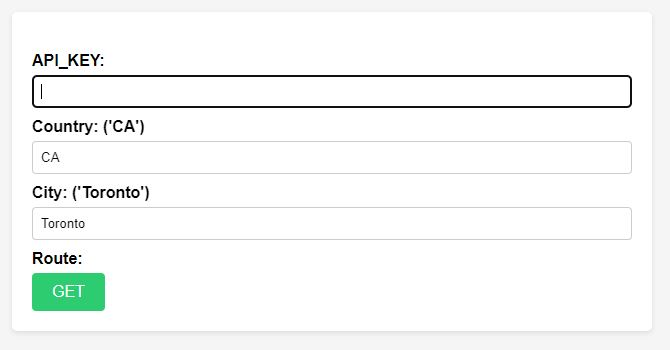
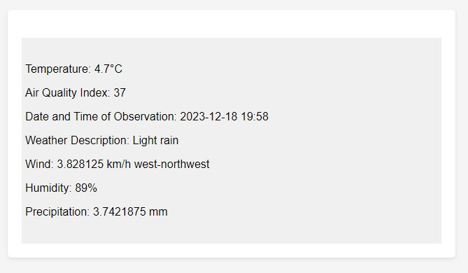

## Weather-API

Weather-API is a web application that retrieves real-time weather information using the Weatherbit API. Users are prompted to provide their own Weatherbit API key along with their country and city to receive current weather data.

## Why Provide Your Own API Key?

We utilize a developmental API key that is valid for 18 days only. To ensure long-term functionality and personal usage, users must supply their own API key from Weatherbit.

## Example Usage

### Input from User

Users are required to enter the following details to retrieve weather information:

- **API_KEY**: Your personal API key from Weatherbit.
- **Country**: The two-letter country code (e.g., 'CA' for Canada).
- **City**: The name of the city (e.g., 'Toronto').

Once the details are entered, clicking the `GET` button will fetch the weather data.



### Output to User

The application will display the following weather details:

- **Temperature**: The current temperature.
- **Air Quality Index**: The local air quality index.
- **Date and Time of Observation**: When the data was observed.
- **Weather Description**: A brief description of the current weather.
- **Wind**: The wind speed and direction.
- **Humidity**: The current humidity percentage.
- **Precipitation**: The current precipitation in millimeters.

Here is an example of the output provided after a user submits their query:



## Getting Started

To get started with Weather-API, follow these steps:

### Prerequisites

Ensure you have [Node.js](https://nodejs.org/en/) installed on your machine.

### Installation

1. Clone the repository:
   ```
   git clone [link to repository](https://github.com/SachithRKA/Weather-API.git).
   ```
2. Navigate to the project directory:
   ```
   cd Weather-API
   ```
3. Install dependencies:
   ```
   npm install
   ```

### Running the Application

1. Start the server:
   ```
   nodemon index.js
   ```
   or if you don't have nodemon installed,
   ```
   node index.js
   ```

2. Access the application:
   Open your web browser and visit:
   ```
   http://localhost:3000
   ```
